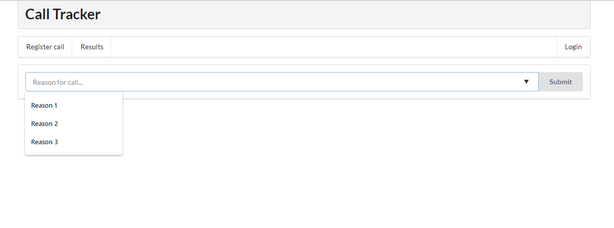
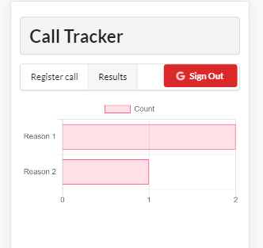

*Work in progress*
# Call Tracker
This web application is meant to be tool to help teams with a support function
build a driver model.  
Support teams often take decisions on how to allocate their resources during
the day or the week following a single phone call with a customer or user in
the need of support.  
So keeping track of the reason for these phone calls is a good way to assess
what drives a given support team.  
Call tracker provides two features:
- Submission of a call reason: performed right after a call has ended
- Visualization of the distribution of call reason

# Architecture
- User interface  
The client is developed using React and Redux.
- Client Hosting  
The application is deployed on an Heroku Dyno.
- Backend  
The data is persisted using a Firebase Realtime Database

# Use the application
 1. Access the application [here](https://call-tracker-esra.herokuapp.com/).
 2. Sign In
 3. Enter reason or select a predefined one  
 
 4. Enter a team name or select a predefined one
 5. Check results: click on the "Results" menu button  

# Customization
To customize the predefined dropdown list, edit [`dropdowns.json`](./src/dropdown.json)

# Resources
- [create-react-app](https://github.com/facebook/create-react-app): Create React apps with no build configuration
- [React](https://reactjs.org/): A JavaScript library for building user interfaces
- [Chart.js](https://www.chartjs.org/): Simple yet flexible JavaScript charting for designers & developers
- [react-chartjs-2](https://github.com/jerairrest/react-chartjs-2): React wrapper for Chart.js
- [Heroku Dynos](https://www.heroku.com/dynos): Lightweight containers for running apps
- [Firebase](https://firebase.google.com/): Mobile and web application development platform
