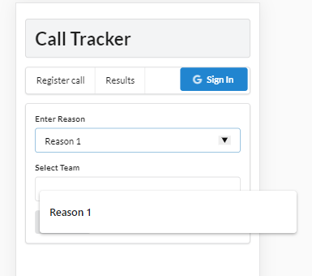

*Work in progress*
# Call Tracker
This web application is meant to be tool to help teams with a support function build a driver model.  
Support teams often take decisions on how to allocate their resources during the day or the week following a single phone call with a customer or user in the need of support.  
So keeping track of the reason for these phone calls is a good way to assess what drives a given support team.  
Call tracker provides two features:
- Submission of a call reason: performed right after a call has ended
- Visualization of the distribution of call reason

Application is deployed on an Heroku Dyno and can be accessed [here](https://call-tracker-esra.herokuapp.com/).

## Register call

## Results

## Resources
- [create-react-app](https://github.com/facebook/create-react-app): Create React apps with no build configuration
- [React](https://reactjs.org/): A JavaScript library for building user interfaces
- [Chart.js](https://www.chartjs.org/): Simple yet flexible JavaScript charting for designers & developers
- [react-chartjs-2](https://github.com/jerairrest/react-chartjs-2): React wrapper for Chart.js
- [Heroku Dynos](https://www.heroku.com/dynos): Lightweight containers for running apps
